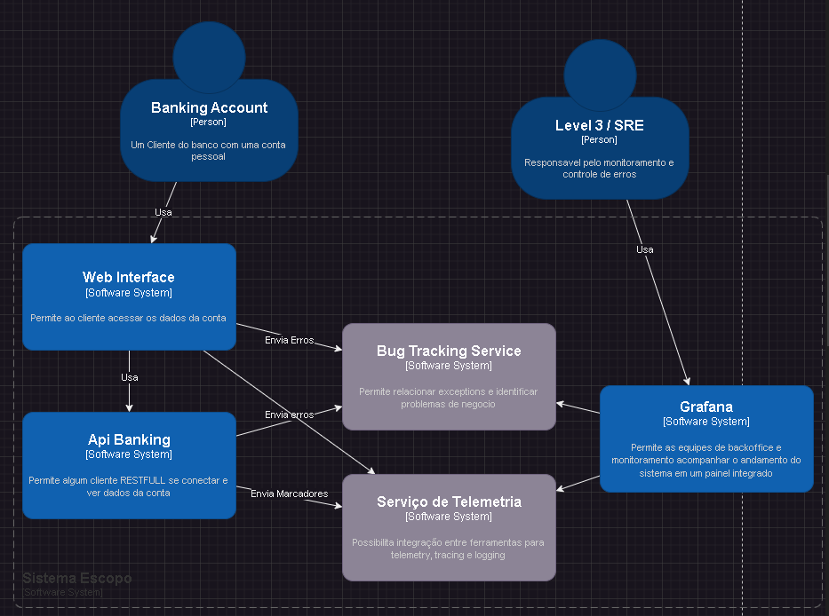
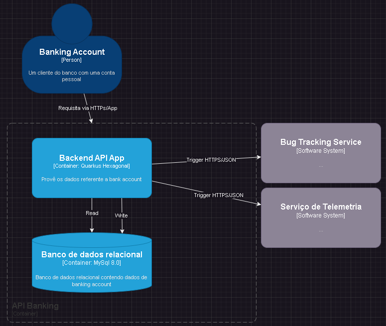
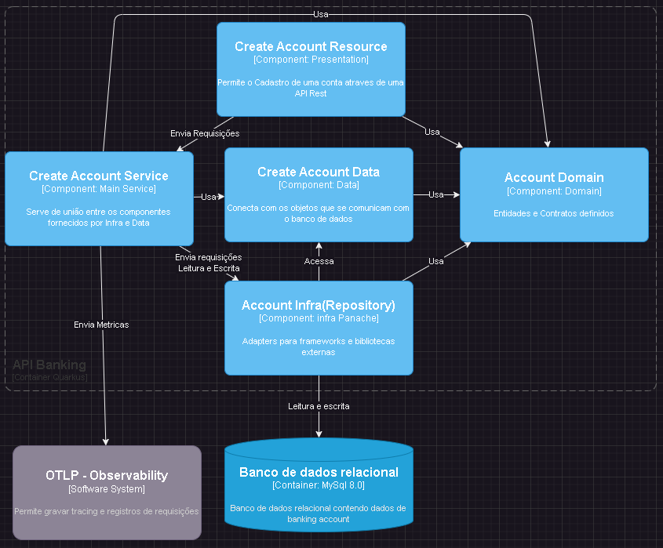

# Guia de Referência para uma arquitetura de software com ênfase em observabilidade e qualidade de software.

Uma arquitetura corporativa bem definida não apenas guia os processos de desenvolvimento de software, mas também fomenta a integração de sistemas, a reutilização de componentes e a manutenção da consistência em todas as soluções desenvolvidas

## Licenças

[](https://choosealicense.com/licenses/mit/)
[](https://opensource.org/licenses/)


## Indice 
* [Requisitos](#requisitos)
* [Instalação](#Instalacao)
* [Referência](#referencia)
* [Arquitetura](#arquitetura)
* [Stack](#tech-stack)
* [Contribuições](#contributing)
* [FAQ](#faq)


## Requisitos
Um dos principais requisitos é a instalação das ferramentas do java.
* [Quarkus Install Guide](https://quarkus.io/guides/getting-started)

Alguns outros são os cadastros nas ferramentas que usaremos com nosso projeto.
* [Sentry Account](https://quarkus.io/guides/getting-started)
* [Codacy](https://www.codacy.com/signup-codacy)
* [VsCode](https://code.visualstudio.com/)
* [Drawio-Plugin](https://marketplace.visualstudio.com/items?itemName=hediet.vscode-drawio)


## Instalação

Baixe o projeto do github: 

[Projeto Guia de Referencia](https://github.com/rodrigoror/pa-igti-guia-de-referencia.git)

Instalar o projeto

```bash
  mvn clean install

  ./mvnw quarkus:dev
```
Agora usando o Postman (ou outra ferramenta de sua preferencia) realize o get para http://localhost:8080/hello O resultado sera similar ao mostrado a seguir

```
curl --location 'http://localhost:8080/hello'

Hello RESTEasy
```
## Pilares do Clean Code
No livro de [Robert Martin](https://www.amazon.com.br/Livros-Robert-C-Martin/s?rh=n%3A6740748011%2Cp_27%3ARobert+C.+Martin), há diversas explicações e justificativas sobre o estilo arquitetural que vamos usar nesse projeto, mas principalmente: 

### Testabilidade 
A possibilidade de testar, inclusive a arquitetura nos permite manter o sistema atendendo os requisitos por muito mais tempo.

### Desacoplamento
A manutenabilidade continuará a ser um ponto de referência desta arquitetura, mesmo após anos e várias equipes depois.

## Referências

[Uncle bob](https://blog.cleancoder.com/uncle-bob/2012/08/13/the-clean-architecture.html)

[Architecure Test - Archunit](https://www.archunit.org/)


## Arquitetura

### C4 Model - nível 1 - Context


### C4 model - nível 2 - Container


### C4 model - nível 3 - Container



## Tech Stack

**Server:** Quarkus, Opentelemetry
**Code Quality:** Codacy
**BugTracking:** Sentry


## Contributing

Contribuições são sempre bem vindas


## FAQ

#### Como posso contribuir com o projeto?

Enviando sua issue ou um PR melhorando a arquitetura de referência.

#### Posso usar o projeto como base para um produto comercial?

Claro, apenas não se esqueça de agradecer e ajudar a comunidade, assim q seu projeto chegar ao MVP.

# O que você irá aprender aqui?

Se você chegou até aqui quer dizer que sua vontade de aprender esse assunto de maneira sólida e definitiva, continua ardente. O passo a passo para configurar e fazer funcionar, foi mostrado anteriormente. Agora, vamos aprender o motivo, as motivações e as recomendações técnicas para a aplicação.

## O que? 

O projeto foi desenvolvido com o objetivo de auxiliar novos entrantes no campo da arquitetura de software, especialmente desenvolvedores que ainda estão tentando entender como transformar um desenho arquitetural teórico em uma aplicação prática. A ideia é seguir o código, explorando a relação prática entre cada componente ou camada da arquitetura, avançando gradualmente conforme fornecemos uma descrição prática e teórica robusta sobre cada tópico abordado.

Nosso foco principal é a Clean Architecture, ou Arquitetura Limpa. A Clean Architecture é um conjunto de princípios e diretrizes que visam criar sistemas de software com alta manutenção, testabilidade e flexibilidade. A premissa básica é a separação clara de responsabilidades, permitindo que as regras de negócio sejam isoladas dos detalhes de implementação, como frameworks, bibliotecas e bancos de dados.

Em termos práticos, a Clean Architecture divide o sistema em várias camadas concêntricas, cada uma com um propósito distinto. No centro, temos as Entidades(pasta Domain), que representam os conceitos de negócio e regras de negócios críticas. Em torno delas, estão os Casos de Uso(pasta Data), que descrevem como as Entidades(Domain) interagem para resolver problemas específicos. Fora dos Casos de Uso, temos a Interface de Adaptação (Infra), que adapta a interface do usuário e a infraestrutura para que possam interagir com os Casos de Uso. Finalmente, na camada mais externa, encontramos os detalhes, como bancos de dados, interfaces de usuário e frameworks específicos.

Para proporcionar uma compreensão completa, abordaremos também outras teorias e padrões arquiteturais. Isso incluirá conceitos como Inversão de Dependência, que é crucial para entender a Clean Architecture, e padrões de design como Repository, Factory e Adapter, que frequentemente complementam a Arquitetura Limpa. Embora esses conceitos adicionais não sejam excessivamente complexos, eles fornecerão uma clareza ímpar sobre a implementação prática e a interação das camadas arquiteturais.

Em resumo, este projeto não só apresentará a Clean Architecture de uma maneira prática e acessível, mas também equipará os desenvolvedores com o conhecimento necessário para aplicar esses princípios em seus próprios projetos, resultando em sistemas de software mais robustos, flexíveis e de fácil manutenção.

## Como? 

Para aprender de forma eficaz neste projeto, adotaremos várias abordagens, sendo a principal delas a leitura de código. A leitura de código é uma prática essencial, especialmente para aqueles que estão começando no mundo da arquitetura de software. Ao ler o código, você poderá observar diretamente como os conceitos teóricos são aplicados na prática, o que facilitará a compreensão e a retenção do conhecimento.

Nossa abordagem prática será baseada em um exemplo concreto utilizando Java e Quarkus. Este stack tecnológico foi escolhido devido à sua popularidade e robustez, bem como pela sua capacidade de suportar arquiteturas limpas e bem estruturadas. Focaremos na separação clara das camadas, o que é um dos pilares da Clean Architecture. Isso garantirá que o processo de aprendizado não apenas seja funcional, mas também mantenha os princípios de limpeza e organização que são críticos para o desenvolvimento de software sustentável e escalável.

Ao navegar pelos READMEs fornecidos no projeto, você encontrará uma estrutura detalhada que guiará seu aprendizado. Cada README será focado em uma camada específica ou em um componente da arquitetura, fornecendo explicações teóricas e exemplos práticos. Este método permitirá que você entenda o propósito de cada camada, como elas interagem entre si e como contribuem para a arquitetura como um todo.

Além dos READMEs, o código fonte será sua principal ferramenta de aprendizado. Analisando o código, você verá implementações reais dos princípios e padrões discutidos. Preste atenção especial à maneira como as dependências são gerenciadas, como as interfaces são definidas e como a lógica de negócios é isolada dos detalhes de infraestrutura. Esta prática não só solidificará seu entendimento teórico, mas também lhe dará insights valiosos sobre boas práticas de codificação e design de software.

Para complementar a leitura de código, encorajamos você a experimentar e modificar o código. Tente implementar pequenas mudanças, adicionar novas funcionalidades ou refatorar partes do código existente. Esta abordagem hands-on reforçará seu aprendizado e permitirá que você veja o impacto direto de suas modificações na arquitetura do sistema.

Em suma, nosso método de aprendizado será altamente interativo e focado na prática. Ao combinar a leitura de código, a navegação pelos READMEs e a experimentação prática, você desenvolverá uma compreensão profunda e aplicada da Clean Architecture utilizando Java e Quarkus. Este conhecimento será fundamental para sua evolução como desenvolvedor e arquiteto de software.

### Vamos para o primeiro capitulo: Codigo do Serviço / Run Service

[Capitulo 1 - Codigo do Serviço / Run Service ](https://github.com/rodrigoror/pa-igti-guia-de-referencia/blob/main/service/service/README.md)