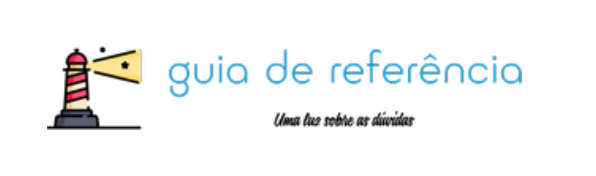

# Guia de Referência para uma arquitetura de software com ênfase em observabilidade e qualidade de software.

Uma arquitetura corporativa bem definida não apenas guia os processos de desenvolvimento de software, mas também fomenta a integração de sistemas, a reutilização de componentes e a manutenção da consistência em todas as soluções desenvolvidas

## Licenças

[](https://choosealicense.com/licenses/mit/)
[](https://opensource.org/licenses/)


## Indice 
* [Requisitos](#requisitos)
* [Installation](#installation)
* [Arquitetura](#Arquitetura)
* [Exemplos](#usageexamples)
* [Stack](#tech-stack)
* [Contribuições](#contributing)
* [FAQ](#faq)


## Requisitos
Um dos principais requisitos é a instalação das ferramentas do java.
* [Quarkus Install Guide](https://quarkus.io/guides/getting-started)

Alguns outros são os cadastros nas ferramentas que usaremos com nosso projeto.
* [Sentry Account](https://quarkus.io/guides/getting-started)
* [Codacy](https://www.codacy.com/signup-codacy)
* [VsCode](https://code.visualstudio.com/)
* [Drawio-Plugin](https://marketplace.visualstudio.com/items?itemName=hediet.vscode-drawio)

## Instalação

Baixe o projeto do github: 

[Projeto Guia de Referencia](https://github.com/rodrigoror/pa-igti-guia-de-referencia.git)

Instalar o projeto

```bash
  mvn clean install

  ./mvnw quarkus:dev
```
Agora usando o Postman (ou outra ferramenta de sua preferencia) realize o get para http://localhost:8080/hello O resultado sera similar ao mostrado a seguir

```
curl --location 'http://localhost:8080/hello'

Hello RESTEasy
```

    
## Arquitetura

### C4 Model - nível 1 - Context


### C4 model - nível 2 - Container


### C4 model - nível 3 - Container


## Usage/Examples

```java
import Component from 'my-project'

function App() {
  return <Component />
}
```


## Tech Stack

**Server:** Quarkus, Opentelemetry
**Code Quality:** Codacy
**BugTracking:** Sentry


## Contributing

Contribuições são sempre bem vindas


## FAQ

#### Como posso contribuir com o projeto?

Enviando sua issue ou um PR melhorando a arquitetura de referência.

#### Posso usar o projeto como base para um produto comercial?

Claro, apenas não se esqueça de agradecer e ajudar a comunidade, assim q seu projeto chegar ao MVP.

